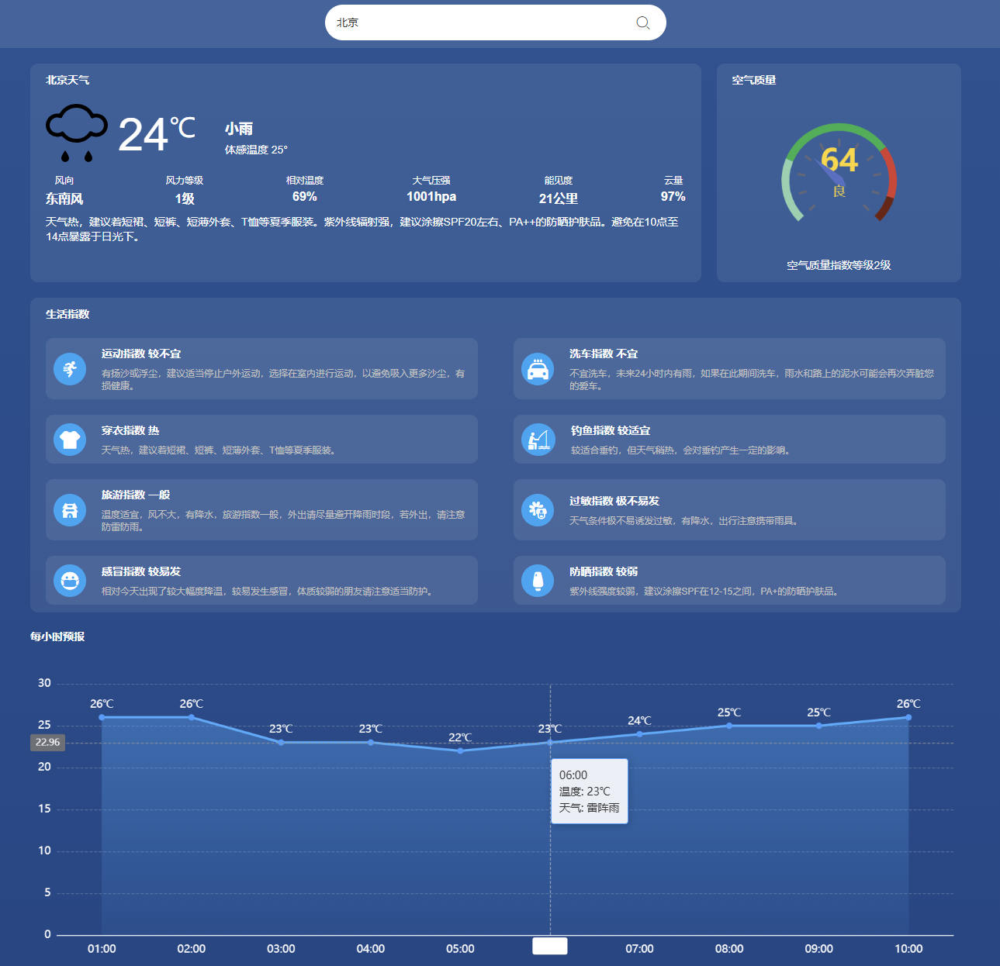

# 🌤️ Vue天气应用

基于Vue 3和ECharts的实时天气应用，使用和风天气API获取精准天气数据
在线演示
🌐 立即体验：(https://vue-weather-app-weld-one.vercel.app)

## ✨ 功能亮点

### 🌡️ 实时天气
- 温度/湿度/风力精确显示
- 体感温度计算
- 动态天气图标展示

### 🔍 城市搜素

### 📊 数据可视化
- 空气质量仪表盘（AQI）
- 10小时温度变化柱状图

### 🧭 生活指南
- 8类生活指数建议
  - 穿衣指数 👕
  - 运动建议 🏃
  - 洗车指南 🚗
  - 紫外线防护 ☂️
  - 感冒预警 🤧
  - 旅游推荐 🧳
  - 钓鱼指数 🎣
  - 防晒提示 😎

## 🛠 技术栈

| 模块           | 技术实现                     |
|----------------|----------------------------|
| **核心框架**   | Vue 3 (Composition API)     |
| **数据可视化** | ECharts 5                  |
| **网络请求**   | Axios       |
| **UI组件**     | Element Plus               |
| **构建工具**   | Vite 4                     |
| **API服务**    | 和风天气API                 |

## 🚀 界面截图

